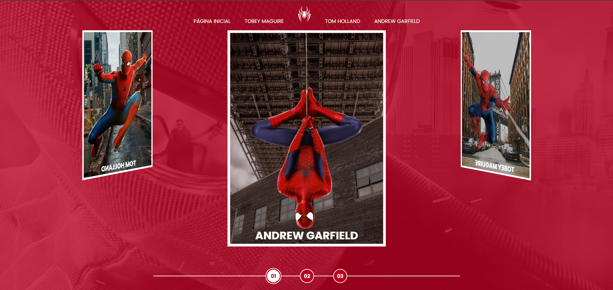
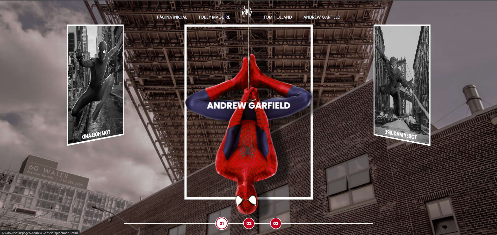

# Projeto Spider-Verse 🕷️🕸️

Bem-vindo ao projeto **Spider-Verse**, uma experiência interativa que celebra o legado dos três principais Homem-Aranha dos cinemas: Tobey Maguire, Andrew Garfield e Tom Holland. Este projeto combina design visual atraente e recursos dinâmicos para oferecer uma jornada única para os fãs do herói aracnídeo. Abaixo, apresentamos uma visão geral das funcionalidades principais do projeto.

## Funcionalidades

## Vizualização

### Carrossel Interativo
O projeto conta com um carrossel de imagens que apresenta os três Homens-Aranha:
- **Tobey Maguire**
- **Andrew Garfield**
- **Tom Holland**

Ao clicar em qualquer imagem do carrossel, o usuário é levado à página de detalhes do respectivo filme. Cada página contém informações exclusivas que tornam a experiência ainda mais interessante.

### Páginas de Detalhes
Cada página dedicada a um dos filmes apresenta:
1. **Sinopse do filme:** um breve resumo da história.
2. **Prints exclusivos:** imagens do filme destacando momentos marcantes.
3. **Trailer:** um vídeo para reviver os momentos mais emocionantes.

### Novas Adições
- **Quizzes interativos:** Agora, cada página de detalhes contém um botão que leva a um quiz interativo. Os quizzes são projetados para testar os conhecimentos dos fãs sobre cada versão do Homem-Aranha, proporcionando um elemento lúdico e educacional ao projeto.
- **Página extra dedicada ao Andrew Garfield:** Para destacar ainda mais sua contribuição como o Homem-Aranha, foi adicionada uma página exclusiva para homenagear este que pra mim é o melhor homen aranha, vou deixar creditos ao Cérebro Espacial, pois o video dele é uma otima homenagem e compactuo com tudo de bom que ele falou sobre o filme e o ator.

## Tecnologias Utilizadas
O projeto foi desenvolvido com as seguintes tecnologias:
- **HTML/CSS:** Para estruturação e estilização das páginas.
- **JavaScript:** Para implementar as interações dinâmicas do carrossel e os quizzes.
- **Frameworks:** (opcional, incluir se aplicável).

## Como Executar o Projeto
1. Clone este repositório: `git clone <https://github.com/DavigfxSs/spider-universe.git>`
2. Abra o arquivo `index.html` em seu navegador.

## Planejando Melhorias Futuras
- Adição de mais conteúdo multimídia, como entrevistas com atores e diretores.
- Integração de um placar global para quizzes, permitindo a competição entre usuários.
- Otimização do design para dispositivos móveis.

Esperamos que você aproveite essa viagem pelo universo do Homem-Aranha. Divirta-se explorando e aprendendo mais sobre nossos heróis favoritos!

